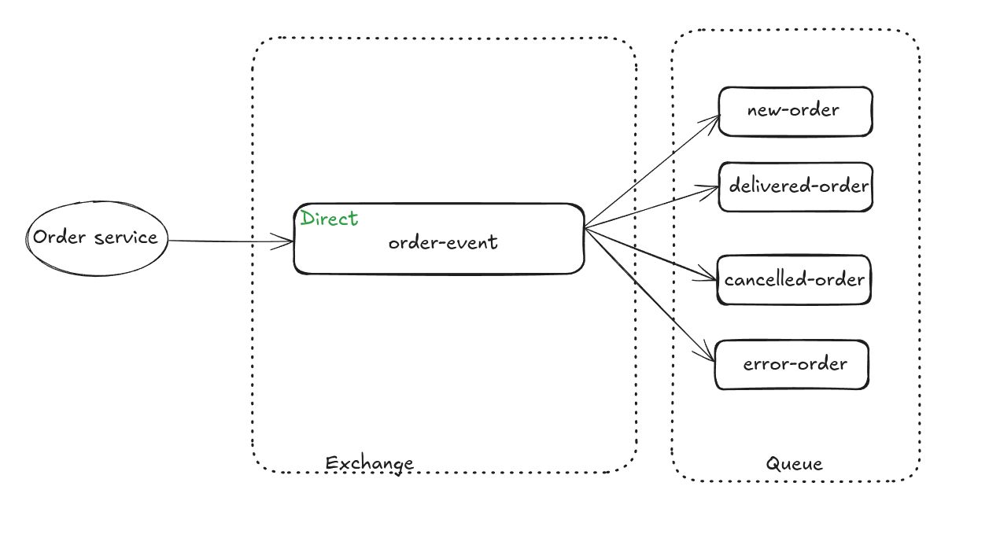

# Bookstore Microservices Project

This is my very first project in microservices using the Spring framework. It demonstrates the use of Spring Boot, Spring Cloud, and Docker to create a microservices architecture.

## Core Components

- **Catalog Service**: Manages the product catalog.
- **Order Service**: Handles customer orders.
- **Notification Service**: Sends notifications to customers about order events.
- **API Gateway**: Acts as a single entry point for all client requests.
- **Web UI**: Provides a user interface for interacting with the services.

---

## Getting Started

- **Swagger UI**: [http://localhost:8989/swagger-ui.html](http://localhost:8989/swagger-ui.html)

---

## Catalog Service

**Domain Layer**
- `ProductEntity`: Core entity representing a product.
- `ProductRepository`: Data access layer for product operations.
- `ProductService`: Business logic implementation.
- `ProductNotFoundException`: Custom exception for product-related errors.

**Web Layer**
- REST Controllers for handling HTTP requests.
- Global exception handling.
- Request/Response DTOs.
- Input validation.

**Configuration**
- Application properties.
- Database configuration.
- Security settings.
- Monitoring configuration.

---

## Order Service

**Domain Layer**
- `OrderEntity`: Core entity representing a customer order.
- `OrderItemEntity`: Represents individual items within an order.
- `OrderEventEntity`: Tracks order state changes and events.
- `OrderRepository`: Data access layer for order operations.
- `OrderService`: Business logic for order management.
- `OrderEventService`: Handles order event processing and state transitions.
- `OrderValidator`: Validates order data and business rules.
- `SecurityService`: Handles security-related operations.
- Custom exceptions:
  - `OrderNotFoundException`: When an order cannot be found.
  - `InvalidOrderException`: When order validation fails.

**Event-Driven Architecture**
- `OrderEventPublisher`: Publishes order events to other services (notification service).
- `OrderEventMapper`: Maps between domain events and event entities.
- Event types: Order created, order status changes, order validation events.

**Web Layer**
- REST Controllers for order operations.
- Global exception handling.
- Request/Response DTOs.
- Input validation.

**Integration**
- Communicates with Catalog Service for product information.
- Integrates with Notification Service for order status updates.
- Uses event-driven communication for service decoupling.

**Features**
- Order creation and management.
- Order status tracking.
- Order validation.
- Event-driven architecture.
- Integration with other microservices.
- Security and authentication.

---

## Notification Service

The Notification Service is responsible for sending notifications to customers about order events such as creation, delivery, cancellation, and errors. It listens to order event messages from RabbitMQ and sends email notifications accordingly.

**Domain Layer**
- `OrderCreatedEvent`, `OrderDeliveredEvent`, `OrderCancelledEvent`, `OrderErrorEvent`: Event models representing different order states.
- `Customer`, `Address`, `OrderItem`: Value objects used in event payloads.
- `OrderEventEntity`: Entity for tracking processed events and preventing duplicate notifications.

**Event Handling**
- `OrderEventHandler`: Listens to RabbitMQ queues for order events and triggers notification logic.
- Uses `@RabbitListener` to consume messages from queues configured in `ApplicationProperties`.

**Logic**
- `NotificationService`: Handles the creation and sending of email notifications for each event type.
- Uses Spring's `JavaMailSender` for sending emails.
- Email content is customized for each event and sent to the customer or support email.

**Configuration**
- Application properties are loaded via `ApplicationProperties` using `@ConfigurationProperties(prefix = "notifications")`.
- RabbitMQ queues and exchange names are configurable.

**Features**
- Sends email notifications for order created, delivered, cancelled, and error events.
- Prevents duplicate notifications by tracking processed event IDs (using `OrderEventEntity` and repository checks).
- Integrates with RabbitMQ for event-driven communication.
- Uses validation annotations for event payloads.

**Example Event Flow**
1. Order Service publishes an event (e.g., order created) to RabbitMQ.
2. Notification Service receives the event from the queue.
3. `NotificationService` composes and sends an email to the customer.
4. The event is marked as processed to avoid duplicate notifications.

---

## API Gateway

The **API Gateway** is built using Spring Cloud Gateway

**Key Features**
- **Routing**: Forwards incoming HTTP requests to the appropriate backend services (Catalog, Order, Notification, etc.) based on route definitions.
- **Swagger UI Aggregation**: OpenAPI documentation from all backend services page at [http://localhost:8989/swagger-ui.html](http://localhost:8989/swagger-ui.html).

**Configuration**
- Routes and filters are defined in `api-gateway/src/main/resources/application.yml`.
- Swagger aggregation is implemented in [`SwaggerConfig.java`](api-gateway/src/main/java/com/kiin/bookstore/gateway/SwaggerConfig.java).

---

## Web app (Web UI)

**Features**
- Product catalog browsing with pagination.
- Add products to cart and manage cart items (update quantity, remove items).
- Place orders with customer and delivery information.
- View order details and order history.
- Secure login/logout using OAuth2 (Keycloak).
- Design using Bootstrap and Alpine.js.

**Architecture**
- Uses Thymeleaf for server-side rendering of HTML templates.
- Communicates with backend services (Catalog, Order) via the API Gateway.
- Secured with Spring Security and OAuth2 client.
- Cart state is managed on the client side using localStorage and JavaScript.

**Key Components**
- `ProductController`: Handles product listing and product API endpoints.
- `OrderController`: Handles cart, order creation, and order history.
- `ClientsConfig`: Configures HTTP clients for backend service communication.
- `SecurityConfig`: Configures security, OAuth2 login, and access rules.

**Configuration**
- API Gateway URL and other properties are managed via `application.properties` and injected using `@ConfigurationProperties`.
- OAuth2 client settings are configured for secure authentication.

**Work flow**
1. Browse products and add them to their cart.
2. Cart data is stored in the browser (localStorage) and managed with JavaScript.
3. Place an order, sends customer and delivery info of the order to the Order Service via the API Gateway.
4. Order Service processes the order, store order to order-db and sends notifications to Notification Service via RabbitMQ.

---

**Development**
- The gateway can be started with the rest of the system using Docker Compose.
- To run tests:  
  ```bash
  ./mvnw test
---

## Monitoring and Observability

- Actuator endpoints at `/actuator`
- Prometheus metrics at `/actuator/prometheus`
- Distributed tracing with OpenTelemetry and Zipkin

---

## RabbitMQ config:

- RabbitMQ is used for event-driven communication between services.

---

## Development

**Code Style**

The project uses Spotless Maven plugin for code formatting. To format your code:
```bash
./mvnw spotless:apply